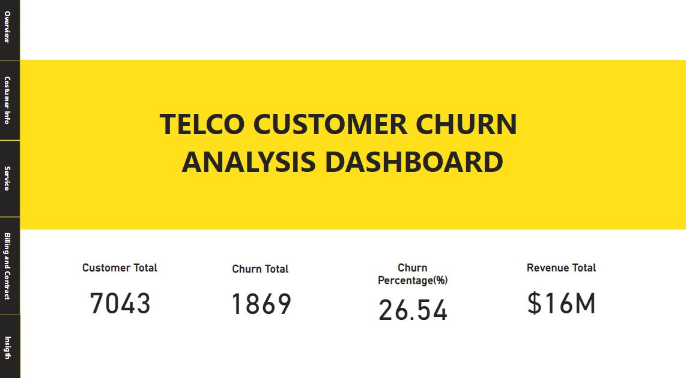
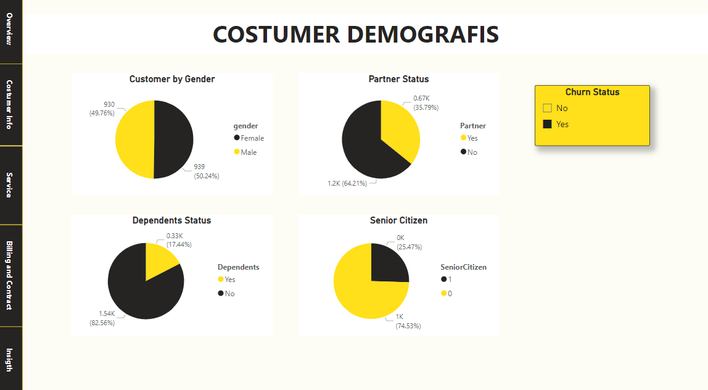
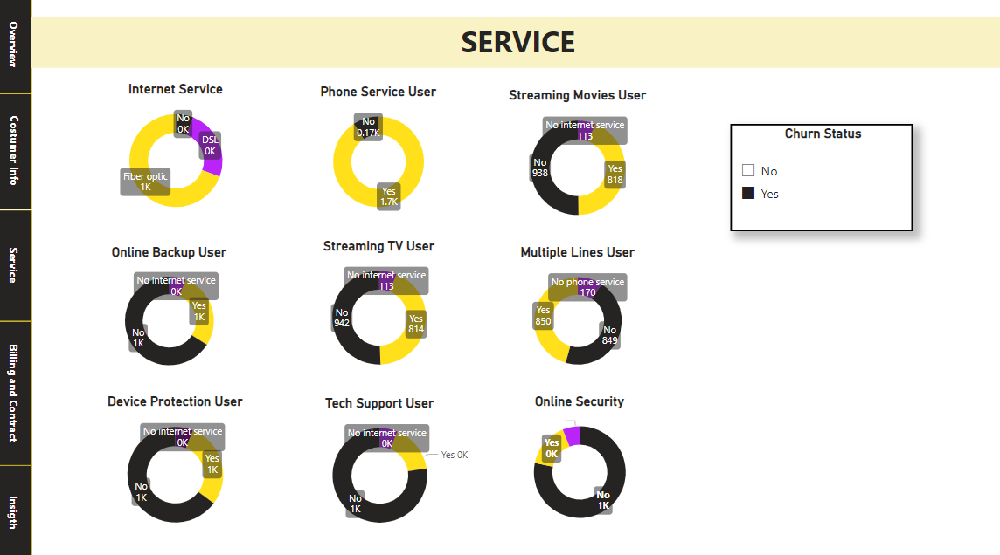
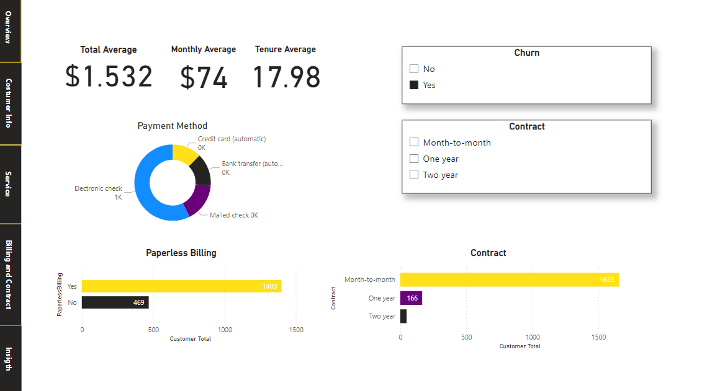

# Customer Churn Analysis

## Project Overview
This project focuses on analyzing customer churn data in telco companies using Power BI dashboards. the purpose of this project is to find insights from data to help reduce churn rates in customers so as to increase customer satisfaction. The dashboard displays customer demographic data, services used, billing and contracts.

## Feature 
* Interactive Dashboard: Visualizes key metrics related to customer churn
* data cleaning dan preprocessing untuk mempersiapkan data menggunakan python pada code [Customer Churn Prediction](https://github.com/Smjfirna/Customer-churn-prediction/blob/main/Notebook.py)
* Actionable Insights: Recommendations based on data-driven findings.
* Comprehensive Documentation: Clear and structured explanation of each step.

## Dashboard Preview
1. Overview

2. Customer Demografis

3. Service

4. Billing and Contract

## Dataset

## Insights

## Run Dashboard
