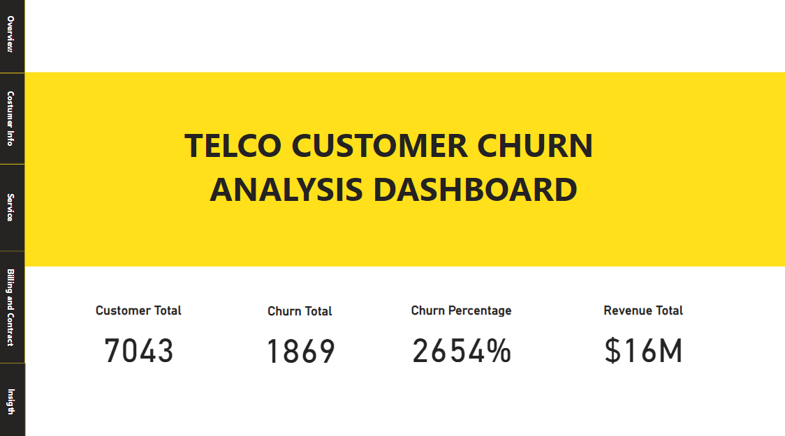

# Telco Customer Churn Analysis

## Project Overview
This project focuses on analyzing customer churn data in telco companies using Power BI dashboards. the purpose of this project is to find insights from data to help reduce churn rates in customers so as to increase customer satisfaction. The dashboard displays customer demographic data, services used, billing and contracts.

## Feature 
* Interactive Dashboard: Visualizes key metrics related to customer churn
* data cleaning dan preprocessing to prepare data using python in code [Customer Churn Prediction](https://github.com/Smjfirna/Customer-churn-prediction/blob/main/Notebook.py)
* Actionable Insights: Recommendations based on data-driven findings.
* Comprehensive Documentation: Clear and structured explanation of each step.

## Tools Used
- **Power BI** for data visualization.
- **Python** for data cleaning and preparation.

## Dashboard Preview
1. Overview

2. Customer Demografis

3. Service

4. Billing and Contract

## Dataset

## Insights and Recommendations
1. Of the 7043 customers, 1869 with a percentage of 26.54% are categorized as churn. with a total revenue of 16 million. the level of churn customers needs to be considered because it has considerable potential to reduce significant revenue.
2. from customer demographic data. gender does not really affect churn, but customers who are classified as dependents, have partners and senior customers have a higher tendency to churn. creating special programs for customers with dependents and senior age such as discounts or special services will increase their loyalty. 
3. Focusing service marketing on groups that do not have dependents and are young because they have a lower churn rate.
4. Fiber Optic customers show a higher churn rate than DSL customers. Improve Fiber Optic customer retention by ensuring service quality remains optimal and offering competitive prices.
5.  Additional services such as Tech Support and Online Security help lower churn rates. Customers who do not have these services are more likely to churn. Encourage customers to add Tech Support or Online Security services by bundling packages to increase loyalty.
6.  Additional services such as Tech Support and Online Security help lower the churn rate. Customers who do not have these services are more likely to churn. Encourage customers to add Tech Support or Online Security services by bundling packages to increase loyalty.
7. Streaming Movies attract customers, but churn is high if they do not use Internet Service. Focus on Streaming Movies customers who have high churn by offering special promos or packages.
8. customers with month to month contracts are more likely to chunrn with high average Monthly Charges. this will cause a decrease in revenue. Segment customers with high Monthly Charges and offer discounts or alternative service options and encourage customers with monthly contracts to switch to annual contracts through incentives such as discounts or gifts.
9. Electronic check payment methods have a higher churn rate than other payment methods such as credit card or auto debit. Promote the autodebit payment method by giving cashback to reduce the churn of electronic check customers.
